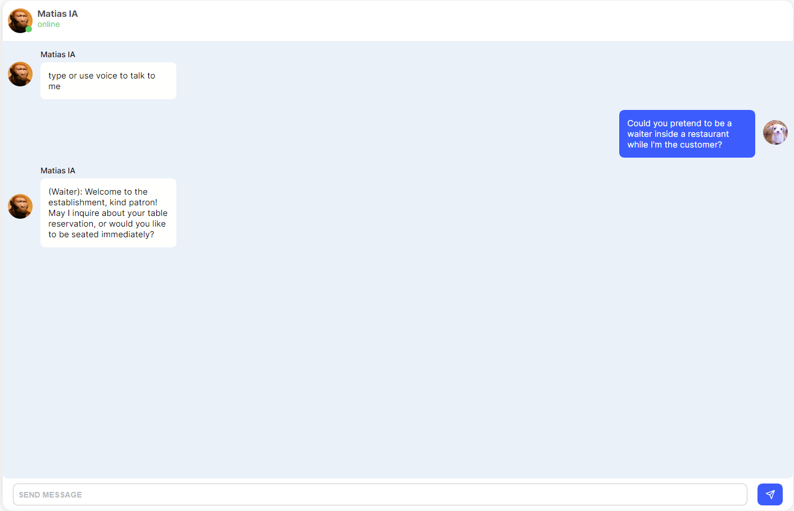

# talk-to-me

Many people who have learned or are in the process of learning a language need to go through the stage of training their speech and often do not have access or are limited due to lack of confidence, so I created this website to train for free

- FUNCTIONS: you can use the microphone or type.

- _OBS:_ the microphone is open for a few seconds, if you don't speak, it will be turned off and to turn it back on, just type any key in the text box and you will see a little red ball in the browser tab notifying you that it is being picked up\

## [-> click here to enter <-](https://talkwithme.vercel.app/)

